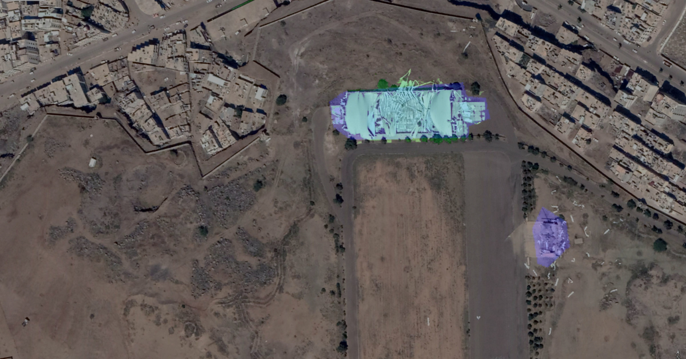

# DESTRUCTION FROM SKY: WEAKLY SUPERVISED APPROACH FOR DESTRUCTION DETECTION IN SATELLITE IMAGERY

WSAN Network Flow diagram.

Image showing detection of destruction by WSAN model.

### Requirenments:
Keras  2.1.6
Tensorflow-gpu 1.12.0
numpy 1.14.1

Dataset Link: https://mega.nz/#!IJdUjCpB!ubv1uBWb4QtQqvwgKoIPppvhHTlqlmPNvFrAxCsmUII
Project Link: http://im.itu.edu.pk/destruction-detection/
### 1. Training

Before Training either download Features from this link https://www.dropbox.com/sh/y55nyifuimkzp37/AADjZCESS8W2VKkn8n-dZLWia?dl=0     
or run this command:

!python feature_extractor.py

To train model just enter this below command:

!python train.py --trainfeatures_filename trainfeatures.pickle --epochs 500

Recommended iterations = 500

### 2. Retraining
To retrain our network put this command:

!python retraining.py --model_name Model1_AttentionNetwork_500.h5 --trainfeatures_filename trainfeatures.pickle --epochs 500

It will retrain the first model using Hard negative mining approach to 500 epochs

### 3. Testing
Before testing the model, there is need to generate segmentation masks.To generate mask enter these two commands one by one:

!python segmentation.py --model_name Model1_AttentionNetwork_500.h5 --test_path Data/test --apply_CRF no

!python segmentation.py --model_name Model2_retrain_AttentionNetwork_500.h5 --test_path Data/test --apply_CRF yes

Now to see Testing results. Enter this command:

!python testing.py --model1_name Model1_AttentionNetwork_500.h5 --model_retrain_name Model2_retrain_AttentionNetwork_500.h5 --features_filename testfeatures.pickle

